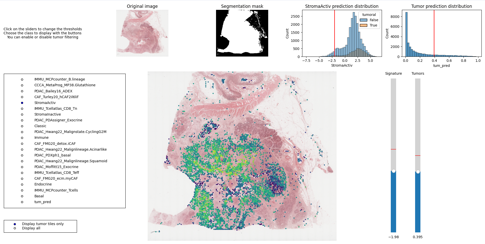

# Prediction of tumor zones and genomic signatures from HES slide



This project aims at predicting genomic signatures and tumor zones from HES slides. The models are trained on microdissected samples and then valided on two cohort of punched samples.

## Installation

Install the requirements in a virtual environment.
First install [OpenSlide](https://openslide.org/download/#binaries). Using a linux distribution is recommended. Else modify the paths to your OpenSlide installation in the file `process_single_WSI/feature_extraction.py`.
Then install the requirements using the following commands :

```bash
pip install -r requirements.txt
pip install timm-0.5.4.tar
```

To get the weights of the base model follow the instruction at [this link](https://github.com/Xiyue-Wang/TransPath/tree/main?tab=readme-ov-file) [or here](https://drive.google.com/file/d/1DoDx_70_TLj98gTf6YTXnu4tFhsFocDX/view).

## Process a single WSI

To process a single WSI, use the script `/process_single_wsi/process_wsi.py`. The script will extract the tiles, extract the features, and then use the trained models to predict the signature and the tumor zone. The results are then saved in csv files and an interactive visualization is available through the script `/process_single_wsi/display_wsi.py`.

```bash
python process_single_wsi/process_wsi.py --temp_dir <path_to_temp_dir> --wsi <path_to_wsi> --ctranspath <path_to_ctranspath> --model_sign_path <path_to_model_sign> --model_tum_path <path_to_model_tum> --device <device> --batch_size <batch_size> --num_workers <num_workers> --display
```

Where :

- `<path_to_temp_dir>` is the path to the temporary directory where the results will be saved
- `<path_to_wsi>` is the path to the WSI. Can be a .svs, .ndpi, .qptiff
- `<path_to_ctranspath>` is the path to the ctrans model downloaded during installation
- `<path_to_model_sign>` is the path to the text file containing the signature names to be predicted. Default is `dataset/best_sign.txt`
- `<path_to_model_tum>` is the path to the tumor model. Default is `dataset/model_tum_seg.pth`
- `<device>` is the device to use for the predictions. Default is `cuda:0`
- `<batch_size>` is the batch size for the feature extraction. Default is `512`
- `<num_workers>` is the number of workers for the feature extraction. Set to 0 if using windows. Default is `0`
- `--display` is a flag to display the WSI and the tiles.

## Initial Data processing

### Data aggregation

First we aggregate the data to several csv files to have a summary of the data in the file `data_processing/create_cohort.ipynb`. The goal is to have for the three cohort a table resuming the data for each sample. This includes :

- The name of the sample
- The identifier of the patient
- If available, some tabular data about the patient/sample
- The path to the HES slide
- The path to the annotation file, if available
- The signature data

### Data preprocessing

Then we preprocess the slides.

First we extract the tiles from the WSI using `data_processing/filter_whites_multiscale.py`. It basically segment the slide using Otsu's thresholding method followed by a few morphological operations. It exports a file containing the coordinates of the tiles as `[z,k,x,y]` where `z` is the zoom level, `k` is the index of the tile, and `x` and `y` are the coordinates of the tile in the slide at level `z`. Some visualizations are available in the notebook `visualize_tiles.ipynb`.

This step is needed to now performs annotation extraction. For the **MDN** cohort, we extract the different annotations and find which tiles are included in the annotations. We use the script `data_processing/extract_annotations.py`. For the **Multicentric** cohort, we follow the same step with an additional cleaning of the annotations in the script `data_processing/extract_annotations_panc_.py`. Some visualizations are available in the notebook `data_processing/visualize_export_annotations.ipynb`.

Finally we can extract the features for all tiles in all WSI. To do so we use the script `feature_extraction.py`. For each WSI the feature vector is of shape (n_tiles, 3 + embed) where the first columns is the resolution, the 2nd and 3rd are the coordinates of the tile, and the rest are the features.
Remark on installation : the script uses CTransPath whose installation is described on [their GitHub](https://github.com/Xiyue-Wang/TransPath/tree/main)

### Data exploration

In the notebook `data_processing/count_dataset.ipynb` we explore the data. We count the number of tiles per slide, the number of tiles per patient... We also visualize the distribution of the annotations and also explore the correlation between the different signatures, which is also done, much more in depth, in the notebook `src/inference/analyze_results.ipynb`.

## Model training

### Signature prediction

Using the scripts `src/signatures/train.py` and `src/signatures/train_all_sign.py`we train a model for each signature to predict the signature from the tiles. We use grid search to tune the hyperparameters. The model used is based on **DeepMIL**. The models are trained using cross validation. Thus we can inspect results and trainings in the notebook `inspect_training.ipynb` to choose the best model.

### Tumor zone prediction

Using the script `src/tumors/train.py` we train a model to predict the tumor zone from the tiles. The model used is based on a simple **MLP**. The model is trained with different hyperparameters. Thus we can inspect results and training in the notebook `src/tumors/inspect_training.ipynb` to choose the best model.

## Inference

### Inference on the whole dataset

In order to perform inference on the whole dataset, we use the script `src/inference/inference_cohort.py` and `src/inference/infer_all_cohort.ps1`. It uses the trained models to predict the signature and the tumor zone. The results are then saved in a csv file. The results are then analyzed in the notebook `src/inference/analyze_results.ipynb`.

### Inference on a single WSI

In order to perform inference, we use the script `process_single_WSI/process_wsi.py` to process a single WSI. It will extract the tiles, extract the features, and then use the trained models to predict the signature and the tumor zone. The results are then saved in a csv file and an interactive visualization is available through the script `process_single_WSI/display_wsi.py`.

## Add a new cohort for validation

In order the validate the models, one can add a new validation cohort. Ideally, the cohort should have been sequenced from microdissected regions so as to have the best spatial match between histology and RNA signatures.

The cohort should be strctured as follow. First, all scans must be in the same folder with appropriate names. Then the signatures must have already been extractred and computed using **vst normalization**. There must be a csv file with the following columns :

- `patient_id` : the identifier of the patient
- `sample_id` : the identifier of the sample
- `ID_scan` : the identifier of the scan
- `path_svs` : the path to the WSI (need not to be an *svs* file)
- `path_annotation` : the path to the annotation file (if available)
- `signatures*` : the signatures. The columns must be named accordingly to the signatures.

For example, for a scan with multiple regions annotated, the patient_id and ID_scan will be the same but the sample_id will be different, and so will the signatures.

Then the data can be processed using the same steps as the initial data processing. The scripts `filter_whites_multiscale.py` can be used to extract the tiles, and then `data_processing/extract_annotations.py` or `data_processing/extract_annotations_panc_.py` can be used to extract the annotations. Finally the features can be extracted using `feature_extraction.py`. Then it is only a matter of using the trained models to predict the signature and the tumor zone with the scripts `src/inference/inference_cohort.py`.

## Results


- @author: [Théau Blanchard](https://github.com/Theaublanchard)
